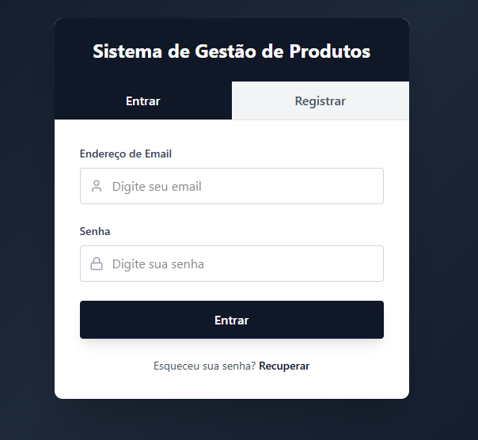
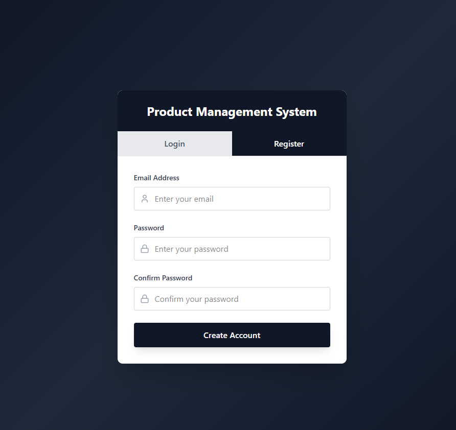
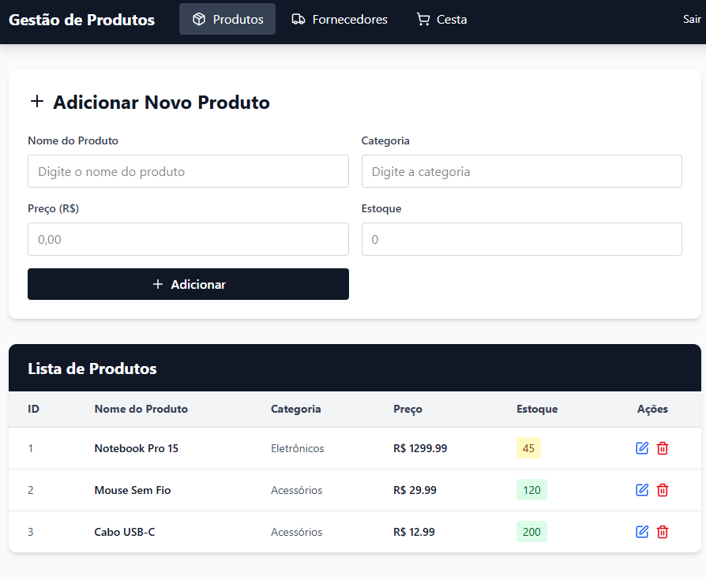
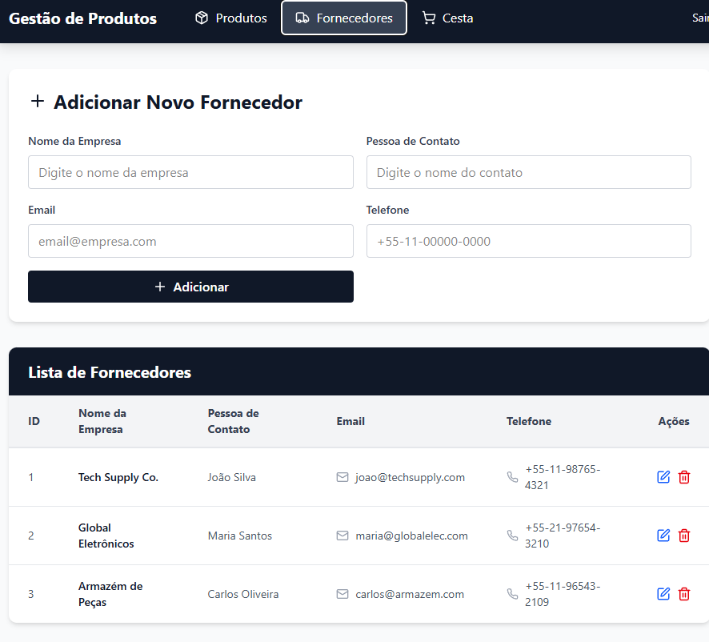
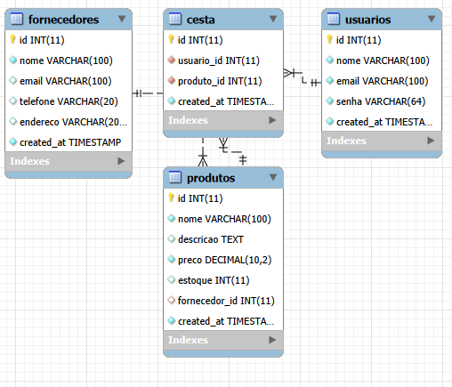

# 🛒 Sistema de Gestão de Produtos

Sistema web para gerenciamento de produtos, fornecedores e cesta de compras desenvolvido com PHP, MySQL, Bootstrap e AJAX.

## 👨‍💻 Integrantes

- Rodrigo Valim Junior - RA: 60000597
- Henrique Nunes Peixoto, RA 60300275

## 🚀 Tecnologias

- PHP com PDO
- MySQL
- Bootstrap 5
- jQuery + AJAX
- HTML5 + CSS3

## ⚙️ Como rodar o projeto

### Pré-requisitos
- XAMPP instalado

### Instalação

1. Clone o repositório dentro da pasta `htdocs` do XAMPP:
```bash
git clone https://github.com/rodrigovalimjunior-cyber/gestao-produtos.git
```

2. Inicie o **Apache** e **MySQL** no XAMPP Control Panel

3. Acesse no navegador:http://localhost/gestao-produtos
4. O banco de dados e as tabelas são criados automaticamente!

## 📋 Funcionalidades

- Cadastro e login de usuários com senha em SHA256
- CRUD de Fornecedores via AJAX
- CRUD de Produtos via AJAX
- Cesta de compras com checkbox de seleção
- Resumo da cesta com valor total e quantidade de produtos
- Validação para adicionar produtos à cesta

## 🎨 Telas do Sistema (Figma)

### Login

### Login


### Produtos


### Fornecedores



## 🗄️ Diagrama Entidade Relacionamento (DER)




<!-- atualizado -->
